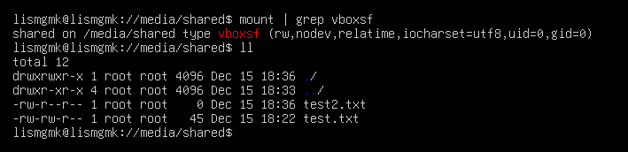
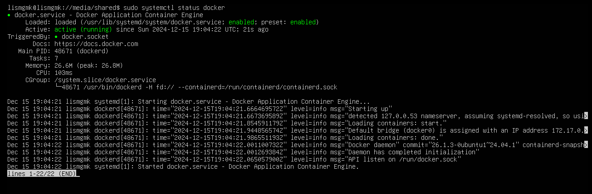
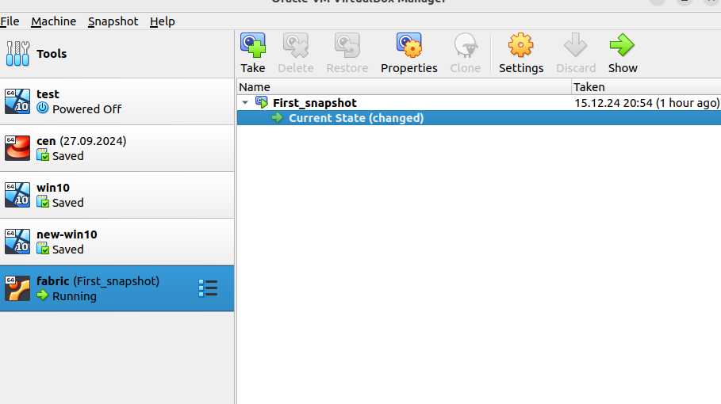

# Настройка SSH-ключа

## Меню
- [Секция с публичным ключом](#секция-с-публичным-ключом)
- [Описание длины ключа](#описание-длины-ключа)
- [Скриншот](#скриншот)

---

## Секция с публичным ключом

**Публичный ключ:**
```plaintext
ssh-ed25519 AAAAC3NzaC1lZDI1NTE5AAAAIPfKocvKT2fQSssNiEApWw99KeDLyfFJSllnXc23K+qx lis@ADM-MNS0257
```
## Описание длины ключа 
Сгенерировал командой 
```ssh-keygen -t ed25519 -C "u.lis" -f ~/.ssh/gitlab_new_key```

Тип ed25519
Алгоритм Ed25519 создаёт ключи фиксированной длины — 256 бит. Это не настраиваемый параметр.


## Скриншот
**вывод команд, позволяющих проверить что общая папка на гостевой машине смонтирована и в нее возможно чтение и запись**



**вывод команд, подтверждающих что сервис докера запущен.**


**финальный снапшото тестовой машины**
