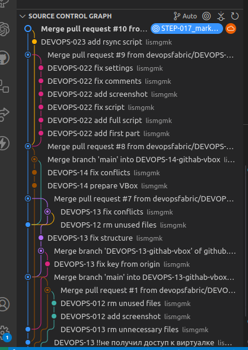

# Руководство по Git и Git GUI

## Меню
1. [Описание операций Git](#описание-операций-git)
2. [Преимущества выбранного Git GUI](#преимущества-выбранного-git-gui)
3. [Скриншот истории коммитов](#скриншот-истории-коммитов)

---

## Описание операций Git

### `git pull`
Команда `git pull` используется для получения изменений из удаленного репозитория и их слияния с текущей веткой. Это сочетание команд `git fetch` и `git merge`.

### `git push`
Команда `git push` отправляет локальные изменения в удаленный репозиторий. Это позволяет синхронизировать ваш код с другими разработчиками.

### `git squash`
`git squash` — это не отдельная команда, а процесс объединения нескольких коммитов в один. Это часто используется для упрощения истории коммитов перед слиянием веток.

### `git reset`
Команда `git reset` позволяет откатить изменения до определенного коммита. Она может быть полезна для отмены локальных изменений или изменения истории коммитов.

---

## Преимущества выбранного Git GUI

Выбранный Git GUI стандартный VSCode предоставляет следующие преимущества:

1. **Удобный интерфейс**: Визуальное представление веток, коммитов и изменений упрощает работу с Git.
2. **История коммитов**: Легко просматривать историю изменений и анализировать, кто и когда внес изменения.
3. **Простота установки**: Идет стандартно в пакете.

---

## Скриншот истории коммитов

Ниже приведен пример того, как отображается история коммитов в выбранном Git GUI:

